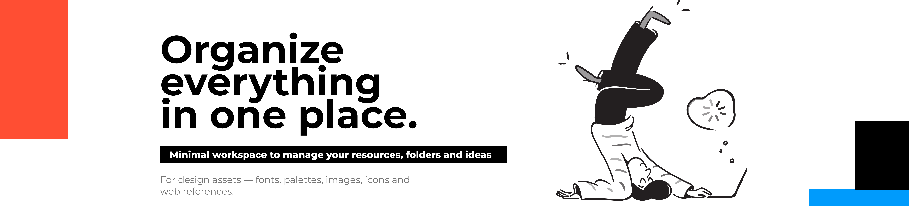
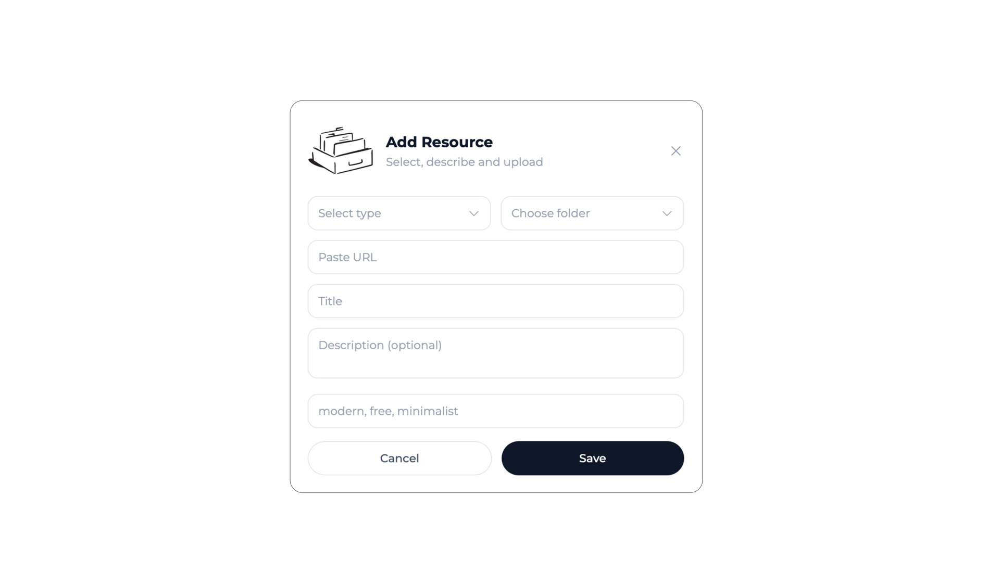

<p align="center">
  
</p>

<p align="center">
  Check the <a href="https://nodefold.vercel.app/"><strong>live demo here</strong></a> and the API documentation <a href="https://nodefold-api-production.up.railway.app/docs#description/roles"><strong>here</strong></a> 
</p>

## 📚 Table of Contents

- [About](#about)
- [Tech Stack](#-tech-stack)
- [Features](#features)
- [Setup & Installation](#️-setup--installation)
- [Environment Variables](#-environment-variables)
- [Architecture](#architecture)
- [Docker & Deployment](#-docker--deployment)
- [Deployment](#deployment)
- [Demo Accounts](#-demo-accounts)
- [Upcoming Improvements](#-upcoming-improvements)
- [Credits](#-credits)

## About

**Nodefold** is a minimal workspace for saving and organizing design assets — fonts, color palettes, images, icons and web references all in one place.

This repository contains the React frontend that consumes the [Nodefold API](https://github.com/miguelm-montano/nodefold-api). Built with React 18 and Vite, it provides a clean and responsive interface with dark/light mode support, a masonry resource grid, folder management and an admin panel.

## 💻 Tech Stack

- **Framework:** React 18
- **Build tool:** Vite
- **Styling:** Tailwind CSS
- **Routing:** React Router v6
- **HTTP client:** Axios
- **State management:** Context API (AuthContext + ThemeContext)

## Features

<p align="center">
  
</p>

### Authentication

- Login, Register and Logout connected to the API via Bearer token

### Dashboard

- Folder management — Create, rename (double click), delete folders and subfolders
- Resource cards — Five card types: Image, Font, Color Palette, Icon, Web
- Resource panel — Right sidebar with full resource details, edit and delete
- Filters — All, Tagged, Untagged with resource counters
- Search — Real-time search by resource name

### Admin panel

- Stats, user management, tag listing, calendar and top tags

### Additional

- Dark / Light mode — Toggle with persistence via localStorage
- Error 404 — Custom not found page

<p align="center">
  
</p>
<p align="center">
  
</p>
<p align="center">
  
</p>
<p align="center">
  
</p>

## 🛠️ Setup & Installation

### Prerequisites

- Node.js >= 18
- **Nodefold API running locally** — follow the [API setup instructions](https://github.com/miguelm-montano/nodefold-api) before starting the frontend.

### Clone the repository

```bash
git clone https://github.com/miguelm-montano/nodefold-front.git
cd nodefold-front
```

### Install dependencies

```bash
npm install
```

### Configure environment

Create a `.env` file in the root:

```bash
cp .env.example .env
```

### Start the API first

In a separate terminal, navigate to `nodefold-api` and run:

```bash
php artisan serve
```

### Start the development server

```bash
npm run dev
```

The app will be available at `http://localhost:5173`

## 🔑 Environment Variables

| Variable       | Description                  | Default                        |
| -------------- | ---------------------------- | ------------------------------ |
| `VITE_API_URL` | Base URL of the Nodefold API | `http://localhost:8000/api/v1` |

> All variables exposed to the browser must be prefixed with `VITE_`. This is a Vite security convention.

## Architecture

Built with **React 18** and **Vite**. Global state is handled via React's Context API:

- **AuthContext** — manages authentication token and user, persisted in `localStorage`.
- **ThemeContext** — manages dark/light mode via Tailwind's `dark` class on `<html>`.

All API calls are centralized in `src/services/` using a shared Axios instance that automatically attaches the Bearer token to every request.

### Services

All API communication is centralized in `src/services/`. No component calls the API directly — they import from the relevant service file. A shared Axios instance in `api.js` automatically attaches the Bearer token to every request via an interceptor.

## 🐳 Docker & Deployment

The project includes a `Dockerfile` for containerized deployment and a `docker-compose.yml` to run the full stack locally.

### Run with docker-compose (recommended for local development)

This is the recommended way to run both the frontend and the API together locally. The `docker-compose.yml` spins up three containers:

- **db** — PostgreSQL 16
- **api** — Laravel API (nginx + php-fpm) on port `8000`
- **frontend** — React app (nginx) on port `5173`

#### Prerequisites

Make sure `nodefold-api` is cloned in the same parent directory:

```
Nodefold/
├── nodefold-api/
└── nodefold-front/   ← docker-compose.yml lives here
```

#### Start the full stack

```bash
cd nodefold-front
docker-compose up --build
```

The app will be available at `http://localhost:5173` and the API at `http://localhost:8000`.

> On first run, the API container automatically runs migrations, installs Passport keys and seeds the admin account. This also happens on every restart. Existing tokens will be invalidated.

### Run the frontend container standalone

To build and run only the frontend container, pass the API URL as a build argument:

```bash
docker build --build-arg VITE_API_URL=https://your-api-url/api/v1 -t nodefold-front .
docker run -p 5173:10000 nodefold-front
```

## Deployment

- **Frontend** — [https://nodefold.vercel.app](https://nodefold.vercel.app)
- **API Docs** — [https://nodefold-api-production.up.railway.app/docs](https://nodefold-api-production.up.railway.app/docs)

## 👤 Demo Accounts

To test the app, use the demo accounts created by the API seeders.

First, run the seeders in the `nodefold-api` project:

```bash
php artisan db:seed
```

| Role  |       Email        | Password  |
| :---: | :----------------: | :-------: |
| Admin | admin@nodefold.com | Admin1234 |
| User  | user@nodefold.com  | User1234  |

- The **user** account will be redirected to the Dashboard
- The **admin** account will be redirected to the Admin panel

## 🚧 Upcoming Improvements

**_Dashboard:_**

- Filter by resource type (Button added)
- Automatic recognition of resource type based on link type
- Select multiple resources at once to delete in batches
- Option to view image resources at full size
- Allow manual HEX input for palettes

**_User Profile_**

- Password confirmation to delete account
- Add avatar as profile photo

**_Admin Panel_**

- Modal to view complete user information
- Select multiple users at once to delete in groups

## 🎨 Credits

Illustrations by:

- **Mary Amato**
- **İlker Türe**
- **Nicolò Canova**

Icons by:

- **Mary Amato**

All icons and illustrations are used for illustrative purposes only. All rights belong to their respective owners.
